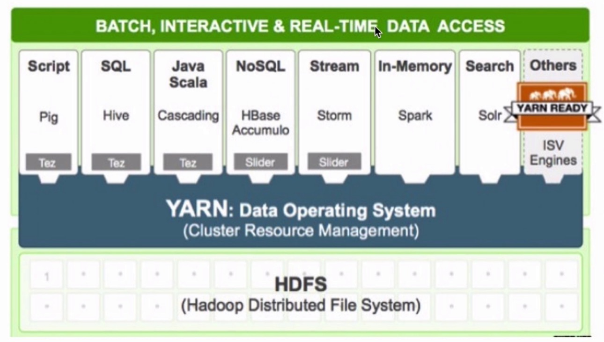

# 大数据学习记录
## 基础知识
大数据四个特征:
* 数据量大
* 多样性，复杂性
* 速度
* 基于高度分析新价值
 
大数据带来的技术变革:
 * 技术驱动: 数据量大
     * 存储: 文件存储 ==> 分布式存储
     * 计算: 单机 ==> 分布式计算
     * 网络: 万兆
     * DB: RDBMS ==> NoSQL(HBase/Redis...)
 * 商业驱动
 
大数据技术概念:
* 单机: CPU Memory Disk
* 分布式并行计算/处理
* 数据采集: Flume Sqoop想
* 数据存储: Hadoop
* 数据处理、分析、挖掘: Hadoop, Spark, Flink...
* 可视化
## Hadoop
### 概述
* 提供分布式的存储(一个文件被拆分成很多个块,并且以副本的方式存储在各个节点中)和计算
* 是一个分布式的系统基础架构:用户可以在不了解分布式底层细节的情况下进行使用
### 组件
* 分布式文件系统: HDFS实现将文件分布式存储在很多的服务器上
* 分布式计算框架: MapReduce实现在很多机器上分布式并行计算
* 分布式资源调度框架: YARN实现集群资源管理以及作业的调度

### HDFS
#### 概述
* 分布式
* commodity hardware
* fault-tolerant 容错
* high throughput 高吞吐量
* large data sets 适用于大数据集
* 文件系统: Linux,Windows,Mac...
    * 目录结构: C   /
    * 存放的是文件或文件夹
    * 对外提供服务: 创建,修改,删除,查看,移动等
* 普通文件系统 VS 分布式文件系统
    * 普通: 单机
    * 分布式: 能够横跨N个机器
#### HDFS前提和设计目标
* Hardware Failure 硬件错误
    * 每个机器只存储文件的部分数据
    * 拆分block,存放到不同的机器上
* Streaming Data Access 流式数据访问
* Large Data Sets 大规模数据集
* 移动计算比移动数据更划算
#### HDFS的架构-重点
* NameNode(master) and DataNodes(slave)
* master/slave架构
* NameNode: 
    * the file system namespace 管理文件系统
    * regular access to files by clients 提供客户端对文件的访问
* DataNode:
    * storage 负责数据的存储
* 一个文件会被拆分成多个block
* 这些block会被存储在不同的DataNode上: 目的是为了容错
* NameNode会执行一系列操作: CRUD
* NameNode也决定了block和DataNodes的对应关系
* 通常情况下: 1个node部署一个组件

#### HDFS具体传输流程
* 写数据流程:


* 读数据流程:


* 具体工作原理可以[参考博客](https://www.cnblogs.com/yinzhengjie/p/10679254.html)
#### HDFS元数据管理
* **元数据**: 实际上就是HDFS的目录结构以及每个文件的block信息(id, 副本系数, block存放在哪个DataNode上)
* 存在什么地方: 对应配置 ${hadoop.tmp.dir}/dfs/name/....
* 元数据存放在文件中:
> 内存中的元数据信息会定期写入到fsimage文件中,但是每次有命令执行时都会写入到edtis日志中,
当NameNode挂了后,再次启动时会根据SecondaryNameNode同步后的fsimage文件和edtis日志信息重新将数据加载到内存,
再通过内存中现有的数据信息生成一份新的fsimage发送给NameNode,这时NameNode加载新的fsimage就可以了

#### HDFS命令行操作
* hadoop fs [generic options]
    * -appendToFile localsrc ... dst: 将本地文件append方式加到目的文件中
    * -cat: 查看内容
    * -chgrp: 更改组
    * -chmod: 更改mod权限
    * -chown: 更改拥有人
    * -copyFormLocal [-f] [-p] [-l] localsrc ... dst: 从本地拷贝到hdfs
    * -copyToLocal [-p] src ... localsrc: 从hdfs拷贝到本地
    * -count: 数量
    * -cp [-f] [-p] src ... dst: 拷贝文件
    * -df
    * -du
    * -get: 取下来
    * -getmerge: 取下来合并
    * -ls
    * -mkdir
    * -moveFromLocal
    * -moveToLocal
    * -mv
    * -put: 上传
    * -rm
    * -rmdir
    * -text: 查看内容
#### HDFS存储扩展
* -put: 1file ===> 1...n block ===> 存储在不同的节点上
* -get: 去NameNode上查找这个file对应的元数据信息
#### 使用HDFS API的方式来操作HDFS文件系统
#### SaveMode
概念: NameNode在启动时会进入到一个指定的状态,这个状态就是SaveMode
* 启动时的30s内会进行检测是否是出于SaveMode状态
* 即当前状态下block的data数据将不会进行复制
* 接收DataNodes传来的心跳和Blockreport信息(信息包含:当前节点有多少个block)
### MapReduce
#### MapReduce概述
* 分布式计算框架
* 源自于Google的MapReduce论文,论文发表于2004年12月
* Hadoop MapReduce是Google MapReduce的克隆版
* MapReduce优点: 海量数据离线处理&易开发&易运行
* MapReduce缺点: 实时流式计算
#### MapReduce案例分析

#### MapReduce编程模型之执行步骤
* 准备map处理的输入数据
* Mapper处理
* Shuffle
* Reduce处理
* 结果输出
#### MapReducer执行流程

* Combiner的优点: 能减少IO, 提升作业执行性能
* **Combiner局限性**: 求平均数
### YARN

#### YARN结构
* Client: 向RM提交任务、杀死任务等
* ResourceManager: 
    * 集群中同一时刻对外提供服务的只有1个,负责资源相关
    * 处理来自客户端的请求(提交、杀死)
    * 启动/监控AM
* NodeManager: 多个
    * 干活（计算）
    * 向RM发送心跳信息、任务的执行情况、启动任务
    * 接收RM的请求来启动任务
    * 接收AM请求的命令
* ApplicationMaster: 
    * 每个应用程序对应一个AM
    * AM会向RM申请资源用于在NM上启动对应的Task
    * 为每个Task想RM申请资源(container)
    * 任务的监控
* container: 
    * 任务运行的抽象
    * memory、cpu...
    * task是运行在container里面的
* master/slave: RM/NM
* 三种调度器: 
    * 先进先出调度器
    * 容量调度器
    * 公平调度器
#### YARN执行流程


## Linux环境记录
* 目录结构:
    * software: 存放课程所使用的软件安装包
    * app: 存放所有软件的安装目录
    * data: 存放课程中使用的数据
    * lib: 存放开发过程中的jar包存放目录
    * shell: 存放课程中相关的脚本
    * maven_resp: maven的仓库
* Hadoop环境:
    * 使用的Hadoop相关版本: CDH
    * 下载地址: [http://archive.cloudera.com/cdh5/cdh/5/](http://archive.cloudera.com/cdh5/cdh/5/)
    * Hadoop使用版本: hadoop-2.6.0-cdh5.15.1
    * Hadoop下载: wget http://archive.cloudera.com/cdh5/cdh/5/hadoop-2.6.0-cdh5.15.1.tar.gz
    * Hive版本: hive-1.1.0-cdh5.15.1
* Hadoop/Hive/Spark相关框架的学习: 使用单机版足够
* 安装Java: 
    * 可以在本地下载再使用scp上传; 或者直接使用wget去官网下载
    * 最后解压到app目录下: tar -zxvf jdk-8u91-linux-x64.tar.gz -C ~/app/
    * 把jdk配置到系统环境变量中: ~/.bash_profile
        * export JAVA_HOME=/home/hadoop/app/jdk1.8.0_91
        * export PATH=$JAVA_HOME/bin:$PATH
        * 使得修改生效: source .bash_profile
* 配置ssh免密登录:
    * 在本地使用: ssh-keygen -t rsa, 生成一对rsa密钥
    * 将公钥上传,即写入到authorized_keys文件中: scp -p ~/.ssh/id_rsa.pub hadoop@10.42.0.126:/home/hadoop/.ssh/authorized_keys
* Hadoop安装:
    * 使用上面的wget命令进行下载
    * 解压到~/app/目录下
    * **添加HADOOP_HOME/bin到环境变量中**
    * 修改Hadoop配置文件,安装包的etc/hadoop目录下:
        * hadoop-env.sh: 配置JAVA_HOME(export JAVA_HOME=/home/hadoop/app/jdk1.8.0_91)
        * **core-site.xml**
        ```
         <property>
            <name>fs.defaultFS</name>
            <value>hdfs://hadoop000:8020</value>
         </property>
        ```
        * **hdfs-site.xml**
        ```
        <property>
            <name>dfs.replication</name>
            <value>1</value>
        </property>
        ```
        * 其他步骤: 创建一个tmp目录并配置hadoop的tmp目录为该目录,不修改可能也不会出问题
        ```
        <property>
            <name>hadoop.tmp.dir</name>
            <value>/home/hadoop/app/tmp</value>
        </property>
        ```
        * 修改slaves文件: hadoop000 (注: 若不修改,默认为localhost)
                                              * 启动HDFS: 
        * **第一次执行的时候一定要格式化文件系统,不要重复执行**: hdfs namenode -format
        * 启动集群: cd $HADOOP_HOME/sbin目录下,使用脚本 ./start-dfs.sh 
        * 验证: jps,成功后可以看到下面结果
        * 如果发现jps是OK的, 但是浏览器打不开: http://10.42.0.126:50070, 多半是**防火墙问题**
            * 查看防火墙状态: firewall-cdm --state
            * 如果显示在运行状态,需要进行关闭: systemctl stop firewalld.service
            * 可以禁止防火墙开机自启: systemctl disable firewalld.service
* Hadoop软件包常见目录说明:
    * bin: hadoop客户端名单
    * etc/hadoop: hadoop相关配置文件存放目录
    * sbin: 启动hadoop相关进程脚本
    * share: 常用例子
    
**注意:**
* start/stop-dfs.sh与hadoop-daemons.sh的关系
    * start-dfs.sh = 
        * hadoop-daemons.sh start namenode
        * hadoop-daemons.sh start datanode
        * hadoop-daemons.sh start secondarynamenode
    * 同理: stop-dfs.sh = .......
## 常见问题
使用脚本./start-dfs.sh启动后,使用jps查看没有DataNode?
[解决方案](https://www.cndba.cn/dave/article/3255)

## HDFS实战
综合实战: 使用HDFS Java API 才完成HDFS文件上的文件的词频统计
* 词频统计: wordCount
===> /test/a.txt
> hello world hello

===> /test/b.txt
> hello world hello

result: hello 4; world 2

* 假设: 有了解过mapReduce、spark等等,觉得这个操作会会很简单
* 本实战的要求: 只允许使用HDFS API进行操作
* 目的:
    * 掌握HDFS API的操作
    * 通过这个案例对后续的mapReduce有一个比较好的认识